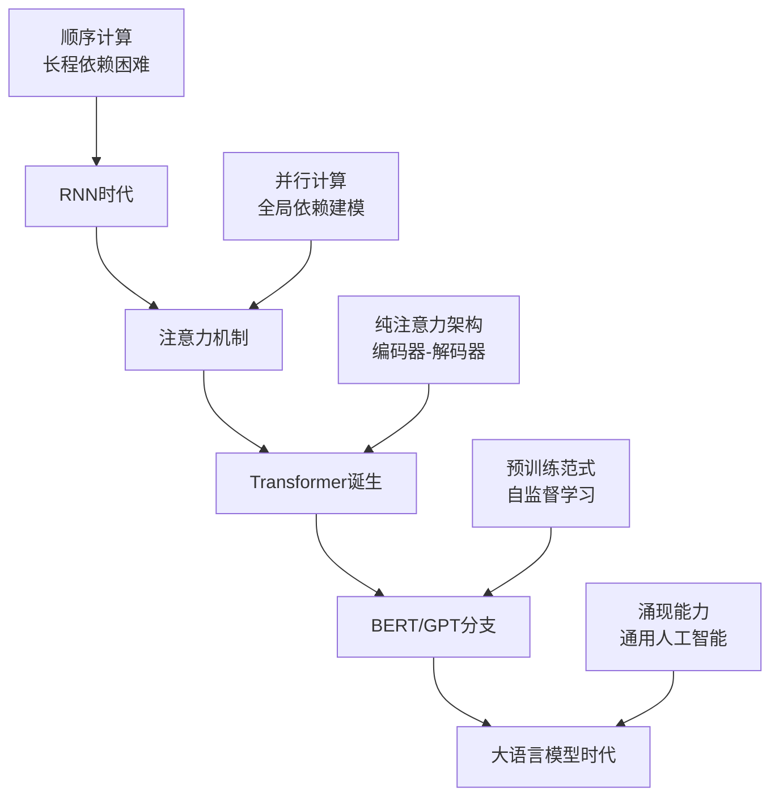

# 第02章：Transformer 核心架构

> **从数学视角解构注意力革命**

## 章节概览

Transformer 架构的提出标志着深度学习的一个重要里程碑。"Attention Is All You Need" 这篇论文不仅改变了NLP领域，也为现代大语言模型奠定了基础。本章将深入探讨 Transformer 的数学本质，理解为什么这个看似简单的架构能够取得如此卓越的成果。

我们将从注意力机制的信息论基础出发，逐步解析多头注意力的子空间分解、位置编码的几何学原理、残差连接的优化理论，以及前馈网络的非线性映射。每个概念都将结合 MiniGPT 的具体实现，做到理论与实践的完美结合。

## 学习目标

完成本章学习后，你将能够：

1. **深刻理解注意力机制**：从信息论和线性代数角度理解注意力的数学本质
2. **掌握多头注意力**：理解子空间分解如何提升模型的表征能力
3. **理解位置编码**：掌握三角函数编码的几何学原理和相对位置建模
4. **精通架构设计**：理解残差连接、层归一化等组件的优化理论基础
5. **实现完整模型**：能够从零实现 Transformer 的每个核心组件

## 本章结构

### [01 注意力机制数学原理](01-注意力机制数学原理/)
**核心概念**: 缩放点积注意力的数学推导与信息论解释
- 注意力的信息论基础：从信息熵到注意力权重
- 缩放点积注意力的几何解释：向量空间中的相似度计算
- 注意力矩阵的概率性质：行随机矩阵的谱理论
- 掩码机制的数学建模：因果约束的矩阵表示
- **代码对应**: `src/model/transformer.py:scaled_dot_product_attention`

### [02 多头注意力子空间分解](02-多头注意力子空间分解/)
**核心概念**: 多头注意力的线性代数理论与并行计算
- 子空间分解的数学框架：从全空间到子空间的映射
- 多头并行的几何意义：不同语义维度的独立建模
- 参数共享与表征多样性：权重矩阵的奇异值分析
- 头间信息融合的理论：输出投影的作用机制
- **代码对应**: `src/model/transformer.py:MultiHeadAttention`

### [03 位置编码几何学](03-位置编码几何学/)
**核心概念**: 正弦位置编码的傅里叶变换理论与相对位置建模
- 傅里叶基函数的位置表示：从离散位置到连续嵌入
- 相对位置的线性表示：三角恒等式的巧妙应用
- 位置编码的频谱分析：不同频率分量的作用
- 长序列外推的数学基础：位置编码的泛化性质
- **代码对应**: `src/model/transformer.py:PositionalEncoding`

### [04 残差连接与层归一化](04-残差连接与层归一化/)
**核心概念**: 深层网络训练稳定性的优化理论
- 残差连接的梯度流分析：恒等映射的优化作用
- 层归一化的统计学原理：激活值分布的标准化
- Pre-Norm vs Post-Norm：不同归一化位置的收敛性分析
- 深度网络的可训练性理论：梯度消失与爆炸的数学机制
- **代码对应**: `src/model/transformer.py:TransformerBlock`

### [05 前馈网络非线性映射](05-前馈网络非线性映射/)
**核心概念**: 位置前馈网络的函数逼近理论与激活函数选择
- 万能逼近定理在Transformer中的体现：非线性变换的必要性
- 激活函数的数学性质：ReLU、GELU、SwiGLU的比较分析
- 前馈网络的容量分析：参数数量与表征能力的关系
- 现代激活函数的设计原理：门控机制与信息流控制
- **代码对应**: `src/model/transformer.py:PositionwiseFeedForward`

## 架构演进历程

## 数学记号统一

为确保一致性，本章采用以下数学记号：

### 基本维度
- $n$: 序列长度 (sequence length)
- $d$: 模型维度 (model dimension)
- $h$: 注意力头数 (number of heads)
- $d_k = d/h$: 每个头的维度 (key/query dimension)
- $d_v = d/h$: 值的维度 (value dimension)
- $d_{ff}$: 前馈网络隐藏层维度

### 注意力相关
- $\mathbf{Q} \in \mathbb{R}^{n \times d_k}$: 查询矩阵
- $\mathbf{K} \in \mathbb{R}^{n \times d_k}$: 键矩阵  
- $\mathbf{V} \in \mathbb{R}^{n \times d_v}$: 值矩阵
- $\mathbf{A} \in \mathbb{R}^{n \times n}$: 注意力权重矩阵
- $\mathbf{W}^Q, \mathbf{W}^K, \mathbf{W}^V$: 线性投影矩阵

### 层归一化
- $\mu$: 均值
- $\sigma^2$: 方差
- $\gamma, \beta$: 可学习的缩放和偏移参数

## 实现映射关系

本章每个数学概念都在 MiniGPT 中有精确的代码对应：

| 数学概念 | 核心公式 | 代码实现 | 关键参数 |
|---------|---------|----------|----------|
| 缩放点积注意力 | $\text{Attention}(Q,K,V) = \text{softmax}(\frac{QK^T}{\sqrt{d_k}})V$ | `scaled_dot_product_attention` | `self.scale` |
| 多头注意力 | $\text{MultiHead}(Q,K,V) = \text{Concat}(\text{head}_1,...,\text{head}_h)W^O$ | `MultiHeadAttention.forward` | `self.n_heads` |
| 位置编码 | $PE_{pos,2i} = \sin(\frac{pos}{10000^{2i/d}})$ | `PositionalEncoding` | `div_term` |
| 层归一化 | $\text{LayerNorm}(x) = \gamma \frac{x-\mu}{\sigma} + \beta$ | `nn.LayerNorm` | `self.norm1/2` |
| 前馈网络 | $\text{FFN}(x) = \text{ReLU}(xW_1+b_1)W_2+b_2$ | `PositionwiseFeedForward` | `self.w_1/2` |

## 学习策略建议

### 层次化学习路径
1. **基础理解**: 先掌握单头注意力的数学原理
2. **扩展学习**: 理解多头注意力的并行机制
3. **深入分析**: 学习位置编码的几何学意义
4. **优化理论**: 掌握残差连接的训练稳定性
5. **实践应用**: 实现完整的 Transformer 模块

### 数学推导建议
- **手工推导**: 重要公式建议手工推导，加深理解
- **代码验证**: 用代码验证数学推导的正确性
- **可视化分析**: 绘制注意力权重、位置编码等的可视化图表
- **实验对比**: 通过消融实验理解各组件的作用

### 工程实践要点
- **从零实现**: 尝试不依赖现有库实现每个组件
- **性能优化**: 理解并行计算和内存优化技巧
- **调试技能**: 掌握注意力可视化和梯度检查方法
- **扩展思考**: 思考架构的改进方向和局限性

## 与其他架构的对比

| 特征 | RNN/LSTM | CNN | Transformer |
|------|----------|-----|-------------|
| 计算复杂度 | $O(nd^2)$ | $O(nkd^2)$ | $O(n^2d)$ |
| 并行度 | 低（顺序） | 高（局部） | 高（全局） |
| 长程依赖 | 困难 | 受限 | 优秀 |
| 可解释性 | 较差 | 较好 | 优秀 |
| 位置感知 | 天然 | 天然 | 需要编码 |

**关键洞察**: Transformer 通过牺牲一定的计算效率，换取了强大的并行性和长程建模能力，这一权衡在大规模预训练时代显得尤为重要。

---

**准备好深入Transformer的数学世界了吗？让我们从注意力机制的基本原理开始！** 🔍