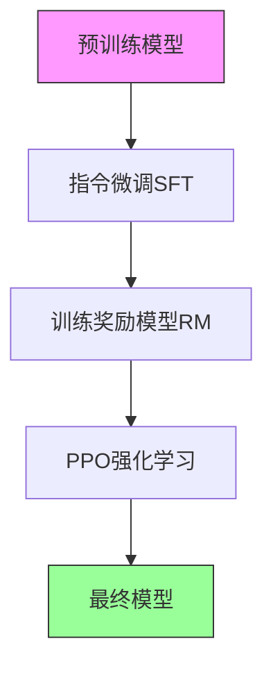

# 大模型后训练实践项目与验证方案

## 实践项目设计

### 项目1：基础微调项目 (入门)
**目标**：掌握指令微调(SFT)基础流程
**时间**：2-3周
**难度**：入门级

#### 任务设计
1. **任务类型**：文本分类 + 问答对话
2. **数据集**：
   - 中文指令数据集：BELLE-2M, Alpaca-zh
   - 文本分类：THUCNews
   - 问答：WebQA, CMRC2018
3. **基座模型**：ChatGLM3-6B 或 Baichuan2-7B
4. **技术方案**：
   - 使用LoRA/QLoRA进行参数高效微调
   - 学习率：2e-4
   - 训练epoch：3-5

#### 验证方案
**离线验证**：
- 准确率 > 85% (文本分类)
- BLEU-4 > 15 (对话生成)
- ROUGE-L > 30

**在线验证**：
- 构建简单Web界面
- 人工评估：50个测试样本，3人评分
- 平均满意度 > 4.0/5.0

#### 代码框架
```python
# 基于transformers + peft的实现
from transformers import (
    AutoTokenizer, 
    AutoModelForCausalLM, 
    TrainingArguments,
    Trainer
)
from peft import LoraConfig, get_peft_model

# LoRA配置
lora_config = LoraConfig(
    r=8, lora_alpha=32, 
    target_modules=["q_proj", "v_proj"],
    lora_dropout=0.1, bias="none"
)
```

### 项目2：奖励模型训练 (进阶)
**目标**：掌握奖励模型(RM)的训练和评估
**时间**：3-4周
**难度**：中级

#### 关键组件
1. **数据集构建**：
   - 使用人类偏好数据：HH-RLHF, OpenAI Summary
   - 数据量：5k-10k偏好对
   - 数据格式：(prompt, chosen, rejected)

2. **模型架构**：
   - 基于DeBERTa-large的回归模型
   - 输出层：单神经元回归头
   - 损失函数：pairwise ranking loss

3. **训练配置**：
   - 学习率：1e-5
   - batch_size：16
   - epoch：3

#### 验证指标
**准确性指标**：
- 偏好预测准确率 > 75%
- Kendall's τ > 0.3
- Spearman ρ > 0.4

**稳定性测试**：
- 交叉验证：5折
- 模型间一致性：> 80%

### 项目3：PPO强化学习训练 (高级)
**目标**：实现完整的RLHF流程
**时间**：4-6周
**难度**：高级

#### 技术栈
- **框架**：TRLX, DeepSpeed + Accelerate
- **算法**：PPO (Proximal Policy Optimization)
- **关键超参**：
  - clip_ratio：0.2
  - kl_penalty：0.1
  - vf_coef：0.1

#### 训练流程


#### 验证方案
**自动评估**：
- 使用TRLX内置的evaluation
- 奖励分数提升 > 20%
- KL散度控制在合理范围

**人工评估**：
- 构建标注平台：基于Gradio
- 评估维度：
  - 有用性 (helpfulness)
  - 诚实性 (honesty)  
  - 无害性 (harmlessness)
- 样本量：200个，3人盲评

### 项目4：DPO对齐优化 (进阶替代)
**目标**：掌握DPO (Direct Preference Optimization)
**时间**：2-3周
**优势**：相比PPO更简单稳定

#### 实现要点
1. **算法优势**：
   - 无需显式奖励模型
   - 直接优化策略
   - 训练更稳定

2. **配置参数**：
   - β (DPO温度)：0.1
   - 学习率：5e-6
   - batch_size：32

3. **验证对比**：
   - 与PPO结果对比
   - 计算效率提升：训练时间减少50%
   - 效果保持：>95%相对性能

## 验证工具与平台

### 自动评估工具
1. **Hugging Face Evaluate**
   ```bash
   pip install evaluate
   pip install transformers[torch]
   ```

2. **关键评估函数**：
   ```python
   import evaluate
   
   # 加载指标
   bleu = evaluate.load("bleu")
   rouge = evaluate.load("rouge")
   bertscore = evaluate.load("bertscore")
   
   # 计算指标
   results = bleu.compute(
       predictions=preds, 
       references=refs
   )
   ```

3. **大模型评测框架**：
   - **OpenCompass**：全面的大模型评测平台
   - **lm-evaluation-harness**：标准化评测
   - **C-Eval**：中文大模型综合性考试评测

### 人工评估平台
1. **自建标注系统** (基于Gradio)
   ```python
   import gradio as gr
   
   def create_annotation_ui():
       with gr.Blocks() as demo:
           prompt = gr.Textbox(label="用户输入")
           response_a = gr.Textbox(label="回复A")
           response_b = gr.Textbox(label="回复B")
           preference = gr.Radio(["A更好", "B更好", "一样好"])
           
           submit_btn = gr.Button("提交评估")
       return demo
   ```

2. **专业标注工具**：
   - **Label Studio**：支持多人协作
   - **Prodigy**：专业NLP标注工具
   - **Amazon SageMaker Ground Truth**

### 监控与追踪
1. **实验管理**：
   - **Weights & Biases (wandb)**
   - **MLflow**：本地实验追踪
   - **TensorBoard**：训练可视化

2. **关键监控指标**：
   - 训练损失曲线
   - 验证指标变化
   - GPU利用率
   - 内存占用

## 部署与A/B测试

### 模型部署方案
1. **本地部署**：
   - **vLLM**：高吞吐量推理
   - **Text Generation Inference (TGI)**：HuggingFace官方方案
   - **FastAPI + Uvicorn**：轻量级部署

2. **云端部署**：
   - **Hugging Face Inference Endpoints**
   - **Amazon SageMaker**
   - **Google Vertex AI**

### A/B测试框架
```python
class ABTestingFramework:
    def __init__(self, model_a, model_b, traffic_ratio=0.5):
        self.model_a = model_a  # 基线模型
        self.model_b = model_b  # 新模型
        self.traffic_ratio = traffic_ratio
        
    def route_request(self, user_id):
        """根据用户ID路由到不同模型"""
        import hashlib
        hash_val = int(hashlib.md5(user_id.encode()).hexdigest(), 16)
        if hash_val % 100 < self.traffic_ratio * 100:
            return "model_a"
        return "model_b"
```

### 关键业务指标监控
1. **用户满意度**：
   - 点赞/点踩比例
   - 用户留存率
   - 对话轮次

2. **系统性能**：
   - 响应时间 (P95, P99)
   - 错误率
   - 资源利用率

3. **业务影响**：
   - 转化率提升
   - 用户活跃度
   - 客服工单减少

## 学习与调试资源

### 调试技巧
1. **模型行为分析**：
   - 使用注意力权重可视化
   - 分析失败案例
   - 梯度检查点

2. **性能优化**：
   - 混合精度训练
   - 梯度累积
   - 检查点保存策略

### 学习资源推荐
1. **在线课程**：
   - DeepLearning.AI的RLHF课程
   - Hugging Face强化学习课程
   - Stanford CS224N

2. **开源项目**：
   - **trlx**：完整的RLHF实现
   - **alignment-handbook**：HuggingFace官方对齐手册
   - **OpenAI baselines**：经典RL算法实现

3. **论文阅读**：
   - "Training language models to follow instructions"
   - "Constitutional AI: Harmlessness from AI Feedback"
   - "Direct Preference Optimization"

## 项目时间表

| 阶段 | 内容 | 时间 | 里程碑 |
|------|------|------|--------|
| 第1周 | 环境搭建 + 数据准备 | 1周 | 环境验证通过 |
| 第2-3周 | 项目1：基础微调 | 2周 | 模型效果达标 |
| 第4-5周 | 项目2：奖励模型 | 2周 | RM准确率>75% |
| 第6-8周 | 项目3：PPO训练 | 3周 | 完整RLHF流程 |
| 第9周 | 项目4：DPO对比 | 1周 | 效果对比报告 |
| 第10周 | 部署测试 | 1周 | 线上验证 |

## 风险与注意事项

1. **计算资源**：
   - 显存需求：PPO训练需要较大显存
   - 建议使用A100或H100
   - 可考虑使用Colab Pro+或云平台

2. **数据质量**：
   - 偏好数据质量比数量更重要
   - 建议先小规模验证再扩大数据

3. **模型安全**：
   - 添加内容安全检查
   - 避免模型产生有害输出
   - 实施输出过滤机制